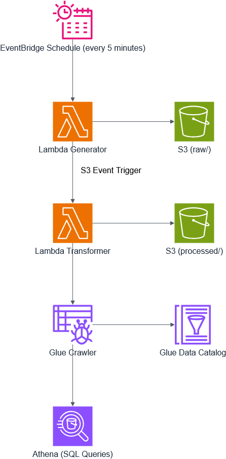
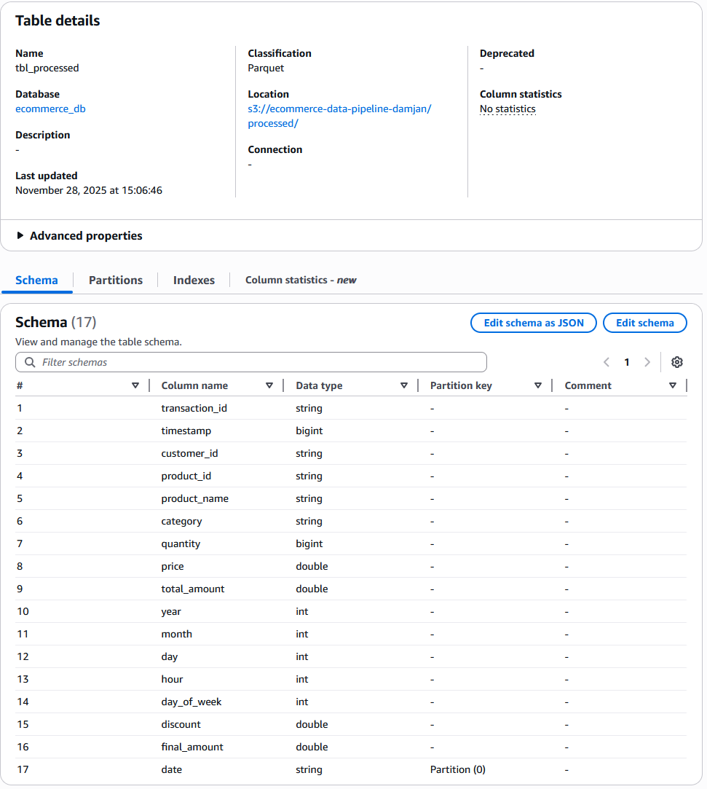
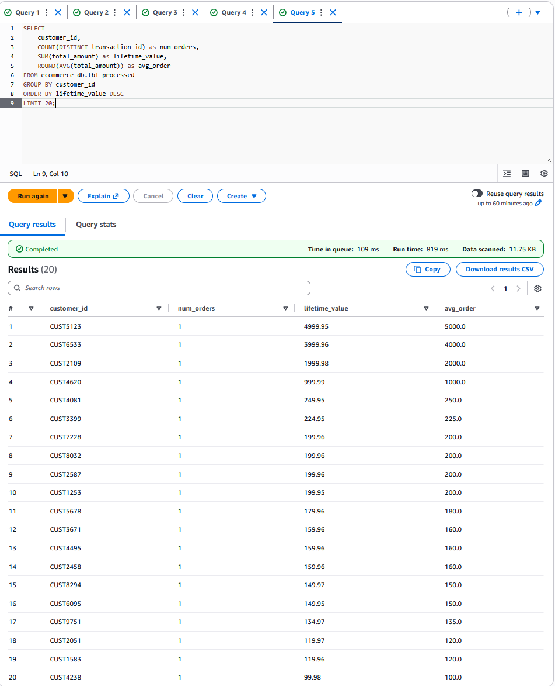

# AWS E-Commerce Data Pipeline



## Project Overview

A fully serverless ETL data pipeline built on AWS that simulates an e-commerce transaction system. The pipeline ingests, transforms, and analyzes transaction data using modern cloud-native services, demonstrating production-ready data engineering practises.

**Cost**: $0.00 (free tier)

## Project Goals

- Demonstrate serverless data pipeline architecture
- Showcase ETL best practises (partitioning, columnar storage, automation)

## Architecture

### Data Flow

1. **Event Bridge** triggers Lambda generator every 5 minutes
2. **Generator Lambda** creates synthetic transaction -> JSON -> S3 `raw/` zone
3. **S3 Event** triggers transformer lambda on new file arrival
4. **Transformer Lambda** processes JSON -> Paraquet -> S3 -> `processed/` zone
5. **Glue Crawler** catalogs data daily, creating/updating table schema
6. **Amazon Athena** enables SQL queries on processed data

### Technologies Used

| Service              | Purpose              | Why This Choice                         |
| -------------------- | -------------------- | --------------------------------------- |
| **AWS Lambda**       | Serverless compute   | No infrastructure management            |
| **Amazon S3**        | Data storage         | Scalable, durable, cost-effective       |
| **AWS Glue**         | Data Catalog         | Automatic schema discovery              |
| **Amazon Athena**    | SQL analytics        | Serverless queries, no ETL needed       |
| **EventBridge**      | Scheduling           | Reliable, serverless cron alternative   |
| **Python 3.12**      | Programming language | Rich data processing ecosystem          |
| **Pandas + PyArrow** | Data transformation  | Industry standard for data manipulation |

---

## Key Features

**Date Partitioning**: organizes data by date for faster queries
**Columnar Format**: Parquet provides 10x better queery performance against JSON
**Event-Driven**: Automatic processing on data arrival
**Serverless**: Zero infrastructure management
**Cost-Optimized**: 100% free tier compatible
**Production Patterns**: Error handling, logging, monitoring

---

## Data Schema

| Column         | Type      | Description                      |
| -------------- | --------- | -------------------------------- |
| transaction_id | string    | Unique transaction identifier    |
| timestamp      | timestamp | Transaction datetime             |
| customer_id    | string    | Customer identifier              |
| product_id     | string    | Product identifier               |
| product_name   | string    | Product name                     |
| category       | string    | Product category                 |
| quantity       | integer   | Number of items purchased        |
| price          | decimal   | Price per unit                   |
| total_amount   | decimal   | Total transaction amount         |
| year           | integer   | Year extracted from timestamp    |
| month          | integer   | Month extracted from timestamp   |
| day            | integer   | Day extracted from timestamp     |
| hour           | integer   | Hour extracted from timestamp    |
| day_of_week    | integer   | Day of week (0=Monday, 6=Sunday) |



## Sample Querie & Result



---

## Setup Instructions

### Prerequisites

- AWS Account with Free Tier access
- Basic knowledge of AWS Console
- (Optional) AWS CLI for automation

### Step 1: Clone Repository

```bash
git clone https://github.com/yourusername/aws-ecommerce-data-pipeline.git
cd aws-ecommerce-data-pipeline
```

### Step 2: Create S3 Bucket

```bash
aws s3 mb s3://ecommerce-pipeline-yourname
aws s3api put-object --bucket ecommerce-pipeline-yourname --key raw/
aws s3api put-object --bucket ecommerce-pipeline-yourname --key processed/
aws s3api put-object --bucket ecommerce-pipeline-yourname --key athena-results/
```

### Step 3: Create IAM Role

Create role `ecommerce-lambda-role` with policies:

- AWSLambdaBasicExecutionRole
- AmazonS3FullAccess
- AWSGlueConsoleFullAccess

### Step 4: Deploy Lambda Functions

**Generator Lambda:**

- Runtime: Python 3.12
- Memory: 256 MB
- Timeout: 60 seconds
- Code: `lambda/generator/lambda_function.py`
- Environment Variable: `BUCKET_NAME=your-bucket-name`

**Transformer Lambda:**

- Runtime: Python 3.12
- Memory: 512 MB
- Timeout: 120 seconds
- Code: `lambda/transformer/lambda_function.py`
- Layer: AWSSDKPandas-Python312

### Step 5: Configure Triggers

- EventBridge rule: `rate(5 minutes)` → Generator Lambda
- S3 trigger: `raw/` prefix, `.json` suffix → Transformer Lambda

### Step 6: Setup Glue Crawler

- Database: `ecommerce_db`
- Target: `s3://your-bucket/processed/`
- Schedule: Daily at 2 AM

### Step 7: Query with Athena

- Set query result location: `s3://your-bucket/athena-results/`
- Select database: `ecommerce_db`
- Run sample queries

[Detailed setup guide](docs/setup-guide.md)

### Local Testing

```bash
# Install dependencies
pip install -r lambda/generator/requirements.txt

# Run unit tests
python -m pytest tests/

# Run local simulation
python tests/local_simulation.py
```

### AWS Testing

- CloudWatch Logs: Monitor Lambda execution
- S3: Verify file creation and transformation
- Athena: Validate query results

---

## 🔮 Future Enhancements

### Phase 2 Improvements

- Add Amazon DynamoDB for real-time lookups
- Implement AWS DMS for real database integration
- Create CloudWatch dashboards for monitoring
- Add SNS notifications for pipeline failures
- Implement data quality checks (Great Expectations)
- Add AWS Step Functions for complex workflows

### Phase 3 Scaling

- Add Amazon Kinesis for real-time streaming
- Implement Delta Lake for ACID transactions
- Add Apache Airflow for orchestration
- Create QuickSight dashboards for visualization
- Add machine learning predictions (SageMaker)
