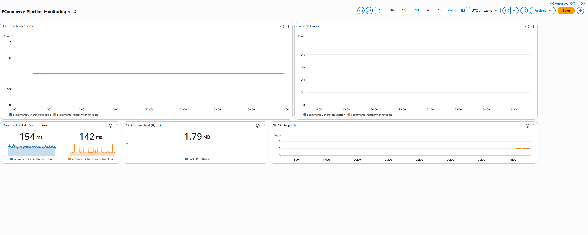
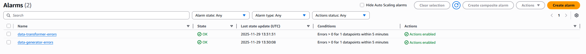
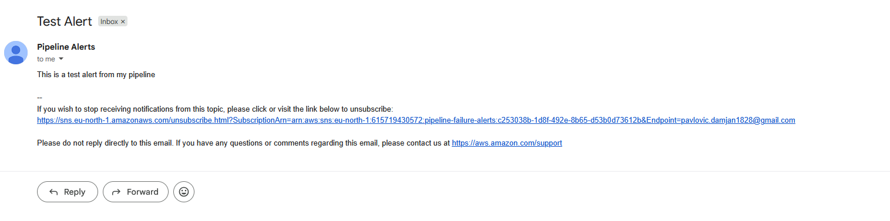

# AWS E-Commerce Data Pipeline


## Project Overview

A fully serverless ETL data pipeline built on AWS that simulates an e-commerce transaction system. The pipeline ingests, transforms, and analyzes transaction data using modern cloud-native services, demonstrating production-ready data engineering practises.

**Cost**: $0.00 (free tier)

## Project Goals

- Demonstrate serverless data pipeline architecture
- Showcase ETL best practises (partitioning, columnar storage, automation)

## Architecture

### Data Flow

1. **Event Bridge** triggers Lambda generator every 5 minutes
2. **Generator Lambda** creates synthetic transaction -> JSON -> S3 `raw/` zone
3. **S3 Event** triggers transformer lambda on new file arrival
4. **Transformer Lambda** processes JSON -> Paraquet -> S3 -> `processed/` zone
5. **Glue Crawler** catalogs data daily, creating/updating table schema
6. **Amazon Athena** enables SQL queries on processed data

### Technologies Used

| Service              | Purpose              | Why This Choice                         |
| -------------------- | -------------------- | --------------------------------------- |
| **AWS Lambda**       | Serverless compute   | No infrastructure management            |
| **Amazon S3**        | Data storage         | Scalable, durable, cost-effective       |
| **AWS Glue**         | Data Catalog         | Automatic schema discovery              |
| **Amazon Athena**    | SQL analytics        | Serverless queries, no ETL needed       |
| **EventBridge**      | Scheduling           | Reliable, serverless cron alternative   |
| **Python 3.12**      | Programming language | Rich data processing ecosystem          |
| **Pandas + PyArrow** | Data transformation  | Industry standard for data manipulation |

---

## Key Features

**Date Partitioning**: organizes data by date for faster queries
**Columnar Format**: Parquet provides 10x better queery performance against JSON
**Event-Driven**: Automatic processing on data arrival
**Serverless**: Zero infrastructure management
**Cost-Optimized**: 100% free tier compatible
**Production Patterns**: Error handling, logging, monitoring

---

## Data Schema

| Column         | Type      | Description                      |
| -------------- | --------- | -------------------------------- |
| transaction_id | string    | Unique transaction identifier    |
| timestamp      | timestamp | Transaction datetime             |
| customer_id    | string    | Customer identifier              |
| product_id     | string    | Product identifier               |
| product_name   | string    | Product name                     |
| category       | string    | Product category                 |
| quantity       | integer   | Number of items purchased        |
| price          | decimal   | Price per unit                   |
| total_amount   | decimal   | Total transaction amount         |
| year           | integer   | Year extracted from timestamp    |
| month          | integer   | Month extracted from timestamp   |
| day            | integer   | Day extracted from timestamp     |
| hour           | integer   | Hour extracted from timestamp    |
| day_of_week    | integer   | Day of week (0=Monday, 6=Sunday) |


## Sample Querie & Result


---

## Pipeline Monitoring

### CloudWatch Dashboard

Real-time monitoring of pipeline health and performance

**Metrics Tracked:**

- Lambda invocations (both functions)
- Lambda error rates
- Average execution duration
- S3 storage utilization
- S3 API request volume



## Alerting & Error Handling

### SNS Alerts

Configured CloudWatch Alarms to monitor pipeline health:



**Alerts Configured:**

- Lambda function failures (both Generator and Transformer)
- Notifications sent via SNS to email
- Triggers when error count > 0 in 5-minute window



**Error Handling Strategy:**

- Try-catch blocks in all Lambda functions
- Detailed logging to CloudWatch Logs
- Automatic retries for transient failures
- SNS notifications for manual intervention

---

## Setup Instructions

Follow these steps to deploy the entire pipeline in your AWS account.

### Prerequisites

- AWS Account with Free Tier access
- AWS Console access

---

### Step 1: Create S3 Bucket

1. Navigate to **S3** service in AWS Console
2. Click **"Create bucket"**
3. Bucket name: `ecommerce-pipeline-yourname` (must be globally unique)
4. Region: Choose your preferred region (e.g., `us-east-1`)
5. Keep all default settings (Block Public Access enabled)
6. Click **"Create bucket"**
7. Open your bucket and create three folders:
   - `raw/`
   - `processed/`
   - `athena-results/`

---

### Step 2: Create IAM Role for Lambda

1. Navigate to **IAM** → **Roles** → **"Create role"**
2. Select **AWS service** → **Lambda** → **Next**
3. Add these permission policies:
   - `AWSLambdaBasicExecutionRole`
   - `AmazonS3FullAccess`
   - `AWSGlueConsoleFullAccess`
4. Click **Next**
5. Role name: `ecommerce-lambda-role`
6. Click **"Create role"**

---

### Step 3: Deploy Data Generator Lambda

1. Navigate to **Lambda** → **"Create function"**
2. Function name: `data-generator`
3. Runtime: **Python 3.12**
4. Execution role: **Use an existing role** → `ecommerce-lambda-role`
5. Click **"Create function"**
6. Copy code from `lambda/generator/lambda_function.py` into the code editor
7. Click **"Deploy"**
8. Go to **Configuration** tab → **Environment variables** → **Edit**
9. Add variable:
   - Key: `BUCKET_NAME`
   - Value: `your-actual-bucket-name`
10. Click **"Save"**
11. In **Configuration** → **General configuration** → Set **Timeout** to `1 min`
12. Test the function: Click **Test** → Create test event → Click **Test**
13. Verify: Check S3 bucket `raw/` folder for a new JSON file

---

### Step 4: Create EventBridge Schedule

1. In the `data-generator` Lambda function page, click **"Add trigger"**
2. Select **EventBridge (CloudWatch Events)**
3. Create new rule:
   - Rule name: `data-generator-schedule`
   - Rule type: **Schedule expression**
   - Schedule expression: `rate(5 minutes)`
4. Click **"Add"**

Pipeline will now generate transactions every 5 minutes automatically!

---

### Step 5: Deploy Transformer Lambda

1. Navigate to **Lambda** → **"Create function"**
2. Function name: `data-transformer`
3. Runtime: **Python 3.12**
4. Execution role: **Use an existing role** → `ecommerce-lambda-role`
5. Click **"Create function"**
6. Scroll to **Layers** section → **"Add a layer"**
7. Select **AWS layers** → Choose `AWSSDKPandas-Python312`
8. Click **"Add"**
9. Copy code from `lambda/transformer/lambda_function.py` into the code editor
10. Click **"Deploy"**
11. Go to **Configuration** → **General configuration** → **Edit**:
    - Memory: **512 MB**
    - Timeout: **2 min**
12. Click **"Save"**
13. Click **"Add trigger"** → Select **S3**
14. Configure trigger:
    - Bucket: Select your bucket
    - Event type: **All object create events**
    - Prefix: `raw/`
    - Suffix: `.json`
15. Check acknowledgment box → Click **"Add"**

Transformer will now automatically process files when they appear in the raw/ folder!

---

### Step 6: Wait for Data

Let the pipeline run for at least 30 minutes to accumulate data.

**Verify it's working:**

- Check S3 `raw/` folder: Should have date-partitioned folders with JSON files
- Check S3 `processed/` folder: Should have corresponding Parquet files
- Check CloudWatch Logs: `/aws/lambda/data-generator` and `/aws/lambda/data-transformer` should show successful executions

---

### Step 7: Setup AWS Glue Crawler

1. Navigate to **AWS Glue** → **Databases** → **"Add database"**
2. Database name: `ecommerce_db`
3. Click **"Create database"**
4. Go to **IAM** → **Roles** → **"Create role"**
5. Select **AWS service** → **Glue** → **Next**
6. Add policy: `AmazonS3FullAccess` (in addition to auto-selected `AWSGlueServiceRole`)
7. Role name: `ecommerce-glue-role`
8. Click **"Create role"**
9. Back in **AWS Glue** → **Crawlers** → **"Create crawler"**
10. Crawler name: `ecommerce-crawler`
11. Click **Next** → **"Add a data source"**
12. Data source: **S3**, Path: `s3://your-bucket/processed/`
13. Click **"Add an S3 data source"** → **Next**
14. IAM role: Select `ecommerce-glue-role` → **Next**
15. Target database: `ecommerce_db` → **Next**
16. Crawler schedule: **Daily** at **2 AM** → **Next**
17. Review and click **"Create crawler"**
18. Select your crawler → Click **"Run"**
19. Wait 1-2 minutes for completion
20. Go to **Tables** → Verify your table was created

---

### Step 8: Query with Amazon Athena

1. Navigate to **Amazon Athena**
2. First time: Click **"Settings"** → Set query result location: `s3://your-bucket/athena-results/`
3. In the **Editor**, select database: `ecommerce_db`
4. Your table should appear in the left panel

**Run sample query:**

```sql
SELECT
    category,
    COUNT(*) as transaction_count,
    SUM(total_amount) as total_sales,
    ROUND(AVG(total_amount), 2) as avg_order
FROM ecommerce_db.your_table_name
GROUP BY category
ORDER BY total_sales DESC;
```

5. Click **"Run"**
6. View results below the query editor
7. Click **"Download results"** to save as CSV

---

### Step 9: Add Monitoring

**CloudWatch Dashboard:**

1. Navigate to **CloudWatch** → **Dashboards** → **"Create dashboard"**
2. Name: `ECommerce-Pipeline-Monitoring`
3. Add widgets for Lambda Invocations, Errors, and Duration

**SNS Alerts:**

1. Navigate to **SNS** → **Topics** → **"Create topic"**
2. Name: `pipeline-failure-alerts`, Type: **Standard**
3. Create subscription: Protocol = **Email**, Endpoint = your email
4. Confirm subscription via email
5. In **CloudWatch** → **Alarms** → Create alarms for Lambda errors
6. Configure alarms to send to SNS topic when errors > 0

---

## Clean Up

To avoid charges after testing:

1. Delete EventBridge rule (stops generation)
2. Delete both Lambda functions
3. Empty and delete S3 bucket
4. Delete Glue crawler and database
5. Delete IAM roles
6. Delete CloudWatch alarms and SNS topic (if created)

---

## Success Checklist

- [ ] S3 bucket created with three folders
- [ ] Both Lambda functions deployed
- [ ] EventBridge schedule running every 5 minutes
- [ ] S3 trigger activating transformer automatically
- [ ] Data in both raw/ and processed/ folders
- [ ] Glue crawler completed successfully
- [ ] Athena queries returning results
- [ ] Zero errors in CloudWatch logs

---

## Expected Results

After running for 24 hours, you should have:

- ~288 transactions in raw/ folder (JSON)
- ~288 transformed files in processed/ folder (Parquet)
- Queryable data via Athena
- CloudWatch metrics showing successful executions
- Total cost: $0 (within Free Tier limits)

---

## Troubleshooting

**Generator not creating files:**

- Check CloudWatch logs for errors
- Verify BUCKET_NAME environment variable
- Ensure IAM role has S3 write permissions

**Transformer not triggering:**

- Verify S3 trigger is configured (prefix: `raw/`, suffix: `.json`)
- Check CloudWatch logs for errors
- Ensure Lambda Layer (Pandas) is added

**Glue Crawler not finding data:**

- Verify files exist in processed/ folder
- Check IAM role has S3 read permissions
- Run crawler manually to test

**Athena query fails:**

- Ensure query result location is set
- Verify table name matches Glue table
- Check that data exists in S3

---

## Timeline

- **Setup time:** 1-2 hours
- **Data accumulation:** 1-7 days (passive)
- **Testing & queries:** 30 minutes
- **Total active work:** ~2-3 hours

---

## Future Enhancements

### Phase 2 Improvements

- Add Amazon DynamoDB for real-time lookups
- Implement AWS DMS for real database integration
- Create CloudWatch dashboards for monitoring
- Add SNS notifications for pipeline failures
- Implement data quality checks (Great Expectations)
- Add AWS Step Functions for complex workflows

### Phase 3 Scaling

- Add Amazon Kinesis for real-time streaming
- Implement Delta Lake for ACID transactions
- Add Apache Airflow for orchestration
- Create QuickSight dashboards for visualization
- Add machine learning predictions (SageMaker)

### Free Tier Limits (12 months)

- **Lambda**: 1M requests/month, 400,000 GB-seconds compute
- **S3**: 5GB storage, 20K GET, 2K PUT requests
- **Glue**: 1M objects crawled/month
- **Athena**: First 10GB scanned/month free
